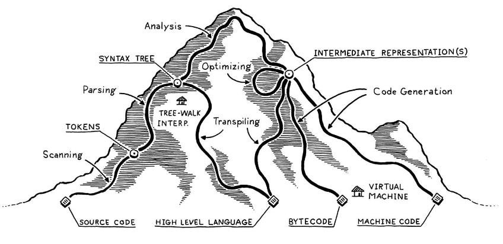
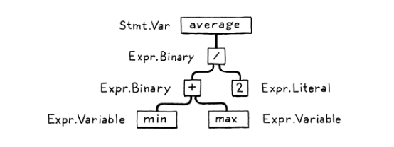

> Taken from Crafting Interpreters

## Interpeters

## Compilers
A **compiler** reads in files in one language and outputs files in another language
- **self hosting** : a compiler implemented by a compiler of the same language it compiles
- **bootstrapping** : process of starting or initializing a compiler, often by using a\
 simpler compiler to load and execute a more complex one

### The Difference 
A compiler translates the entire program into machine code before execution,\
while an interpreter translates and executes code line by line during runtime

## The parts of a Language

### Scanning aka Lexing
A scanner takes in a linear stream of chars and turns them into a **token**
- **token** : smallest units of a program that have meaning to the compiler
### Parsing
>Where syntax gets its grammar

A **parser** uses tokens to build trees of nested grammar

### Static Analysis
